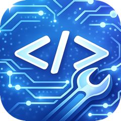

<p align="center">
  
</p>

<h1 align="center">ToolBox</h1>

自作ツールを詰め込む iPhone 向け Flutter アプリ(パッケージ名: `toolbox_mobile` / Bundle ID: `jp.p-jihyo.toolBoxMobile`)。サイドパネル(Drawer)からツールを切り替える構成で、今後ツールを追加していく。

## ツール

| ツール | 説明 |
|---|---|
| GitHub Projects | GitHub Projects (v2) のボードをカンバン表示。カードの長押しドラッグ or タップメニューでステータス変更、タスク追加、GitHub で開く。ラベル・Priority などの単一選択フィールド・End date をカードに表示。プロジェクトビューの設定ソート順を再現([github-project-menu-bar](../github-project-menu-bar) の移植)。 |

## 見た目

- **ダーク / ライト切り替え**: サイドパネル下部のセグメントボタンで切り替え、設定は端末に保存。デフォルトはダーク
- ダークテーマは GitHub の **dark dimmed(soft dark)** 配色を再現(`lib/main.dart` の `_githubSoftDarkTheme()`)

## セットアップ

Flutter は [mise](https://mise.jdx.dev/) で管理している(`mise.toml`)。

```bash
mise install          # Flutter SDK をインストール
mise exec -- flutter pub get
```

iOS ビルドには Xcode が必要。`xcode-select` は **full Xcode を指している必要がある**(CommandLineTools のままだと、プラグインのビルドフックが iOS SDK を見つけられずビルドが失敗する。`DEVELOPER_DIR` 環境変数だけではフックに伝播しないため不十分):

```bash
sudo xcode-select -s /Applications/Xcode.app/Contents/Developer
```

ネイティブ依存は Swift Package Manager で解決する(CocoaPods 不要、`flutter config --enable-swift-package-manager` 有効化済み)。

## 実行

```bash
mise exec -- flutter run                    # 接続中のデバイス / シミュレータ
mise exec -- flutter build ios --simulator  # シミュレータ向けビルド
mise exec -- flutter build ios --release    # 実機向け(要署名設定)
```

### シミュレータ

```bash
open -a Simulator
mise exec -- flutter run
```

### 実機

1. USB で接続し、iPhone 側で「このコンピュータを信頼」
2. iPhone の 設定 → プライバシーとセキュリティ → デベロッパモード を有効化して再起動
3. 初回のみ `ios/Runner.xcworkspace` を Xcode で開き、Runner ターゲットの **Signing & Capabilities** で自分の Team を選択(free provisioning で可、Team は `project.yml` 相当で `project.pbxproj` に設定済み)
4. `mise exec -- flutter run -d <デバイス名>`
5. 初回起動時は iPhone の 設定 → 一般 → VPN とデバイス管理 で開発者を信頼

free provisioning は **約7日で期限切れ**になるため、起動しなくなったら `flutter run` で入れ直す。

Xcode の **Window → Devices and Simulators** でペアリング済みなら、以降は同じ Wi-Fi 上でケーブルなしでも `flutter run` できる(iOS 17+ は自動、チェックボックスは表示されない)。

## GitHub Projects ツールの設定

1. アプリのボード画面右上 ⚙ → GitHub の **classic PAT** を貼り付けて「検証して保存」
   - 必要スコープ: `project`(プライベートリポジトリのカードを扱うなら `repo` も)
   - トークンは iOS Keychain に保存される
2. プロジェクトを選択するとボードが読み込まれる

## 構成

```
mise.toml                     Flutter のバージョン管理
docs/app_icon.png             README 用アプリアイコン
assets/icons/                 サイドパネル用ツールアイコン
ios/Runner/Assets.xcassets/   アプリアイコン(AppIcon.appiconset)
lib/
  main.dart                   アプリ本体 + ツールレジストリ + サイドパネル + テーマ
  src/
    shell/
      shell_scope.dart        ツール画面からサイドパネルを開くための InheritedWidget
      theme_controller.dart   ダーク/ライト切り替えの状態管理・永続化
    tools/
      tool.dart               ツール定義(id / name / icon / builder)
      github_project/
        models.dart           Project / Board / BoardCard + ビューソート再現ロジック
        github_api.dart       GitHub GraphQL API クライアント
        board_view_model.dart 状態管理(楽観的更新つき)
        board_screen.dart     カンバンボード UI
        settings_screen.dart  PAT 入力・プロジェクト選択
        status_color.dart     GitHub カラー enum → Color
        token_store.dart      Keychain / UserDefaults ラッパー
test/
  sort_test.dart              ソート再現ロジックの単体テスト
  widget_test.dart            シェルのスモークテスト
```

## ツールの追加方法

1. `lib/src/tools/<tool_name>/` に画面を実装
2. `lib/main.dart` の `tools` リストに `Tool(...)` を追加

サイドパネルには自動で表示される。

## テスト

```bash
mise exec -- flutter analyze
mise exec -- flutter test
```
